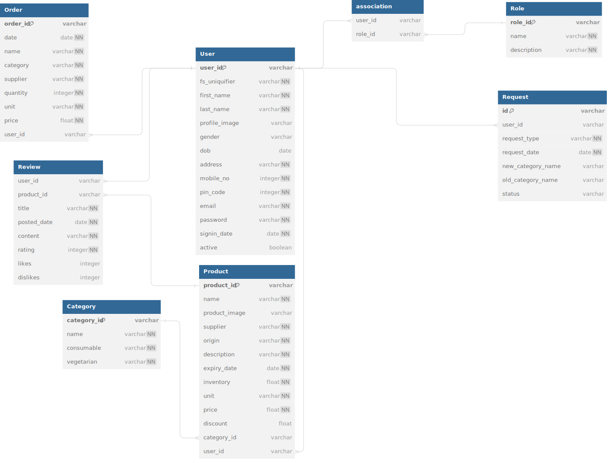

# Welcome to Paper Basket (Grocery Store App)
Paper Basket is a web app with automation. It's used for purchasing groceries, which has one 
admin, with multiple store managers and customers. Admin adds or removes categories and checks new store manager sign-ups and requests from store manager regarding category modifications. Customers can purchase from the store. Store managers can add new products and make requests regarding categories.

## DB Diagram


## Frontend server
### Prerequisites
- Node.js
### Installation
```shell
npm install
```
### Development Server
```shell
npm run serve
```
### Production Build
```shell
npm run build
```
### Production Server
```shell
serve -s dist
```
### Frontend structure
* src : Contains the source code of the application for running npm run serve
* public : Contains static assets.
* dist : Generated production ready files after running npm run build.

## Backend server
### Prerequisite
- Python
### Virtual Environment
Install virtualenv package (if not already installed)
```shell
pip install virtualenv
python -m virtualenv .env
```
### Activate the Envirnoment
```shell
./.env/Scripts/Activate.ps1
```
### Install Dependencies
```shell
pip install -r requirements.txt
```
### Development server
```shell
python app.py development
```
### Production server
```shell
python app.py production
```
### Celery Tasks
```shell
celery -A application.celery worker --loglevel info --pool=solo
```
### Celery Scheduled Tasks
```shell
celery -A application.celery beat --loglevel info
```
### Create databases
Visit [127.0.0.1:5000/](127.0.0.1:5000/) to create databases for the backend server.
### Deactivate the Environment
```shell
deactivate
```
### Backend structure
* application : Contains the configuration and blueprints registered
* database : Contains the database of the application
* user, category, product, review, cart, order : APIs for each features

## Dependencies
### Windows
* [MailHog_windows_amd64.exe](https://github.com/mailhog/MailHog/releases/download/v1.0.1/MailHog_windows_amd64.exe) to launch local mail server, for more details [visit MailHog](https://github.com/mailhog/MailHog)
* [wkhtmltox-0.12.6-1.msvc2015-win64](https://github.com/wkhtmltopdf/packaging/releases/download/0.12.6-1/wkhtmltox-0.12.6-1.msvc2015-win64.exe) install it and add bin for wkhtml in PATH, depedency for pdfkit, for more details [visit wkhtmltopdf](https://wkhtmltopdf.org/index.html)

In WSL
* ```sudo apt install redis``` to install redis, for more details [visit Redis](https://redis.io/docs/install/install-redis/install-redis-on-windows/)

### Launch MailHog server
Visit [localhost:8025](localhost:8025) to access the MailHog server.
### Launch redis server
```bash
sudo service redis-server start
```
## Contact
For inquiries, reach out to [21f1000731@ds.study.iitm.ac.in](mailto:21f1000731@ds.study.iitm.ac.in)
